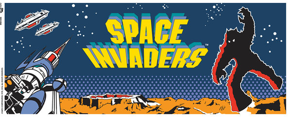
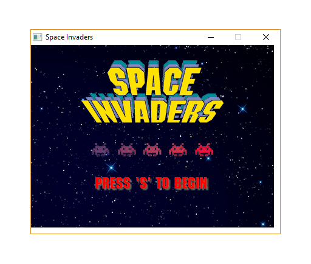
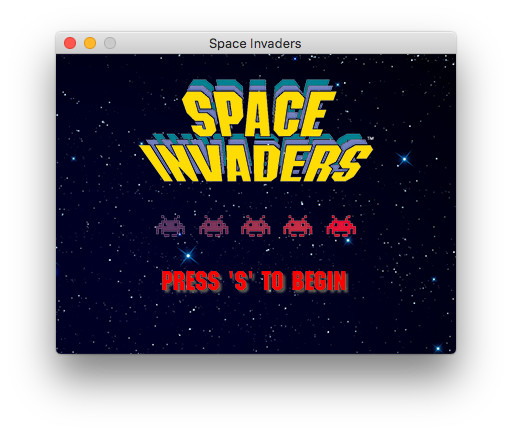
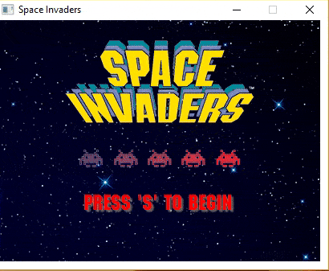

# Create a simple cross-platform desktop Space Invaders game with Go

A few months ago I fiddled around with [writing Space Invaders using Go](https://sausheong.github.io/posts/space-invaders-with-go). I had a lot of fun writing it but the output only worked on iTerm2 because it used a specific feature of that terminal. In order to play the game you'd really have to download iTerm2 and run it on the command line. I thought it'd be fun to muck around it a bit more to see if I can bring it out as a proper desktop game.



Now, if you know much about Go at all you would know that there simply isn't any good GUI toolkit or library. Go wasn't designed with UI in mind so there certainly aren't any UI packages in the standary library. There is the usual GTK and QT bindings, but generally I try to avoid bindings if I can help it. The more popular way of writing desktop apps in Go is really to create a web app and then front it with a browser like interface. A common way of doing this is using [Electron](https://electronjs.org), a framework used to write cross-platform desktop apps using Javascript, HTML and CSS. Plenty of desktop apps have used Electron, including Slack and Github's desktop apps, and even the editor I'm using now (Visual Studio Code).

However, Electron is pretty heavy, uses quite a bit of Javascript and has tonnes of documentation to wade through. I was  looking for something Go-oriented and simple to just kickstart. More importantly I simply wanted to use what I already created earlier, which is nothing much more than simply displaying a series of images rapidly such that it looks properly animated.

Then I stumbled on this little Go library called [webview](https://github.com/zserge/webview). Webview is tiny and simple library that wraps around webview (MacOS), MSHTML (Windows) and gtk-webkit2 (Linux). Its documentation for the Go part is just a page or so! 


# Serve the frames

Let's take stock at what we need to do:

1. Build a web app that will serve out the frames
2. Create the webview that will show the web app

## Build the web app

We start off with spinning out a separate goroutine to run the web app, then displaying a static HTML page from the webview.

```go
var frame string                         // game frames
var dir string                           // current directory
var events chan string                   // keyboard events
var gameOver = false                     // end of game
var windowWidth, windowHeight = 400, 300 // width and height of the window
var frameRate int                        // how many frames to show per second (fps)
var gameDelay int                        // delay time added to each game loop

func init() {
	// events is a channel of string events that come from the front end
	events = make(chan string, 1000)
	// getting the current directory to access resources
	var err error
	dir, err = filepath.Abs(filepath.Dir(os.Args[0]))
	if err != nil {
		log.Fatal(err)
	}
	frameRate = 50                                         // 50 fps
	gameDelay = 20                                         // 20 ms delay
	sprites = getImage(dir + "/public/images/sprites.png") // spritesheet
	background = getImage(dir + "/public/images/bg.png")   // background image
}

// main function
func main() {
	// run the web server in a separate goroutine
	go app()
	// create a web view
	err := webview.Open("Space Invaders", "http://127.0.0.1:12346/public/html/index.html",
		windowWidth, windowHeight, false)
	if err != nil {
		log.Fatal(err)
	}
}
```

The web app is simple and straightforward.

```go
func app() {
	mux := http.NewServeMux()
	mux.Handle("/public/", http.StripPrefix("/public/", http.FileServer(http.Dir(dir+"/public"))))
	mux.HandleFunc("/start", start)
	mux.HandleFunc("/frame", getFrame)
	mux.HandleFunc("/key", captureKeys)
	server := &http.Server{
		Addr:    "127.0.0.1:12346",
		Handler: mux,
	}
	server.ListenAndServe()
}
```

I didn't use anything fancy, it's just your typical Go web app with 3 handlers. It also serves out html and other assets through a directory named `public`.  The `start` handler starts the game, the `frame` handler returns the frame and the `key` handler receives the keyboard events.

```go
// start the game
func start(w http.ResponseWriter, r *http.Request) {
	t, _ := template.ParseFiles(dir + "/public/html/invaders.html")
	// start generating frames in a new goroutine
	go generateFrames()
	t.Execute(w, 1000/frameRate)
}
```
The `start` handler starts generating frames in a separate goroutine, then calls the `invaders.html` template, passing it the frame rate.

```go
// capture keyboard events
func captureKeys(w http.ResponseWriter, r *http.Request) {
	ev := r.FormValue("event")
	// what to react to when the game is over
	if gameOver {
		if ev == "83" { // s
			gameOver = false
			go generateFrames()
		}
		if ev == "81" { // q
			os.Exit(0)
		}

	} else {
		events <- ev
	}
	w.Header().Set("Cache-Control", "no-cache")
}
```

The `captureKeys` handler receives keyboard events from the webview and takes action accordingly. If the game ended, you can restart or quit the game. Otherwise all keyboard events are placed into the events channel.

```go
// get the game frames
func getFrame(w http.ResponseWriter, r *http.Request) {
	str := "data:image/png;base64," + frame
	w.Header().Set("Cache-Control", "no-cache")
	w.Write([]byte(str))
}
```

At every interval, the webview will call `getFrame` for the frame. The frame is a [image data URI](https://en.wikipedia.org/wiki/Data_URI_scheme) with the base64 encoded image. This is then passed on to the `` tag in the HTML template (which we'll see later). Notice that we set the `Cache-Control` header to `no-cache`. This is a workaround for MSHTML (in Windows specifically) because otherwise the image frame will cached and the game will be stuck at the first frame.

# Show the frames


The frames are shown on a HTML page. The start page, doesn't need to be animated (or can be animated through a video clip or a gif) so it can be a totally static page.


```go
<!doctype html><meta charset=utf-8>
<html>
    <head>
        <style>
        body {
            background-image: url("/public/images/start.png");
            background-repeat: no-repeat;
        }        
        </style>
        <script src="/public/js/jquery-3.3.1.min.js"></script>
        <script type="text/javascript">
            $("body,html").keydown(function(event) {
                if ( event.which == 13 ) {
                    event.preventDefault();
                }
                if ( event.which == 83 ) {
                    window.location.href="/start";
                }
            });               
        </script>
    </head>
</html>
```

It just captures keyboard events through JQuery, and redirects to `start` handler when `s` is pressed. This will start the game.

Once we start the game, the game loop is triggered and frames are created repeatedly. A `gameDelay` variable is introduced in the game loop to slow down the game if it becomes too fast. Displaying the frames is all about using JQuery and retrieving frame one at a time regular interval. 

To do this, I simply used `setInterval`, with the frequency provided by the `start` handler. The function in `setInterval` uses the Jquery `get` method to retrieve the data URI from the `frame` handler, and changes the value in the `src` attribute of the `` tag with the `image` ID.

I also monitor the `keydown` event and use the JQuery `get` method to send the value captured to the `key` handler.

```go
<!doctype html><meta charset=utf-8>
<html>
    <head>
        <style>
        body {
            background-image: url("/public/images/background.jpg");
            background-repeat: no-repeat;
            margin: 0;
        }
        </style>
        <script src="/public/js/jquery-3.3.1.min.js"></script>
        <script type="text/javascript">
            setInterval(function() {
                $.get('/frame', function(data) {
                    $('#image').attr('src', data);
                });
            }, {{ . }});

            $("body,html").keydown(function( event ) {
                if ( event.which == 13 ) {
                    event.preventDefault();
                }
                $.get('/key?event='+event.which);
            });
        </script>
    </head>
    <body>
        
    </body>
</html>
```
This is how the start screen looks on Windows.



This is how it looks on a Mac.




# Play some sound

Games work better with game sounds and effects. I got the Space Invaders special effect sounds from [Classics United](http://www.classicgaming.cc/classics/space-invaders/sounds) website and also used the [Beep](https://github.com/faiface/beep) package to play them.  

```go
// play a sound
func playSound(name string) {
	f, _ := os.Open(dir + "/public/sounds/" + name + ".wav")
	s, format, _ := wav.Decode(f)
	speaker.Init(format.SampleRate, format.SampleRate.N(time.Second/20))
	speaker.Play(s)
}
```

Playing the sound effect is simply getting the WAV file, decode it and play it back. Unfortunately the package closes the file after decoding it so I have to reopen the file every time, but it works well enough.


# Game logic changes

Let's first look at the changes I need to make to the Space Invaders game. Most of the code doesn't change, but because we now show the game on a webview so the controls will be on the webview itself. This means I don't need to use Termbox any more. Instead, I just capture keyboard events sent to the webview using the JQuery `keydown` method and send it to the `key` handler. The `key` handler in turn adds it into the `event` channel (previously I send the termbox keyboard event into the channel).

In the main game loop, instead of checking for the termbox keyboard events, I check for the keyboard events from the webview.

```go
for !gameOver {
    // to slow up or speed up the game
    time.Sleep(time.Millisecond * time.Duration(gameDelay))
    // if any of the keyboard events are captured
    select {
    case ev := <-events:
        // exit the game
        if ev == "81" { // q
            gameOver = true
        }
        if ev == "32" { // space bar
            if beam.Status == false {
                beamShot = true
            }
            playSound("shoot")
        }
        if ev == "39" { // right arrow key
            laserCannon.Position.X += 10
        }
        if ev == "37" { // left arrow key
            laserCannon.Position.X -= 10
        }
    default:
    }
    ...
}
```

Note how I play the sound after each time I detect the string `32`, which indicates the space bar being pressed.

Something else that changes in the game is the way the scores are displayed. When the game ended previously I simply showed the scores on the terminal. Now that I don't have a terminal to display the scores on, the best to do it is on the screen. What I need to is write text on the end game frame.

To do this, I used the `image/font` package in the Go standard library sub-repositories. As a refresher, the Go standard library sub-repositories are experimental packages that are found under `golang.org/x/*`. In particular the `golang.org/x/image/font` package provides us with basic capabilities to create write lines of text on an image.

When I said basic I really meant basic. While it can be used to do more complicated stuff, I ended up using the basic features only (primarily to keep the code simple).

```go
// print a line of text to the image
func printLine(img *image.RGBA, x, y int, label string, col color.RGBA) {
	point := fixed.Point26_6{X: fixed.Int26_6(x * 64), Y: fixed.Int26_6(y * 64)}
	d := &font.Drawer{
		Dst:  img,
		Src:  image.NewUniform(col),
		Face: inconsolata.Bold8x16,
		Dot:  point,
	}
	d.DrawString(label)
}
```

The `printLine` function takes in an image, the coordinates to write the text, the text itself and the color of the text, then draws a lines of text with the given color at the specified coordinates. The font used is a ready-made one from the `inconsolata` package.

This is how it's used in the game code.

```go
// show end screen and score
endScreen := getImage(dir + "/public/images/gameover.png").(*image.RGBA)
printLine(endScreen, 137, 220, fmt.Sprintf("Your score is %d", score), color.RGBA{255, 0, 0, 255})
printLine(endScreen, 104, 240, "Press 's' to play again", color.RGBA{255, 0, 0, 255})
printLine(endScreen, 137, 260, "Press 'q' to quit", color.RGBA{255, 0, 0, 255})

createFrame(endScreen)
```

# Source code

You can find the source code here.

https://github.com/sausheong/invadersapp

# How it looks

That's all there is to it! I didn't go through the game code because I've already explained it in the previous [blog post](https://sausheong.github.io/posts/space-invaders-with-go). 

In the mean time, here's how it looks on Windows. The response is a bit shaky because I don't actually own a Windows machine and tested it and created the video on a VirtualBox VM.



This is how it looks on a Mac.


Have fun!


# Thank yous

A shout-out to Ibrahim Wu, who helped me to debug the app on Windows and also discovered the problem with MSHTML caching.